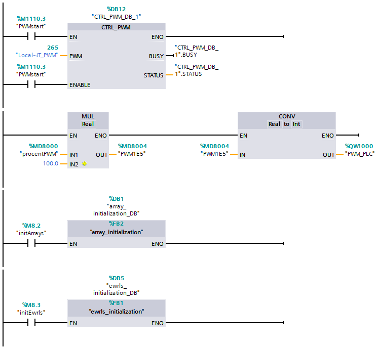
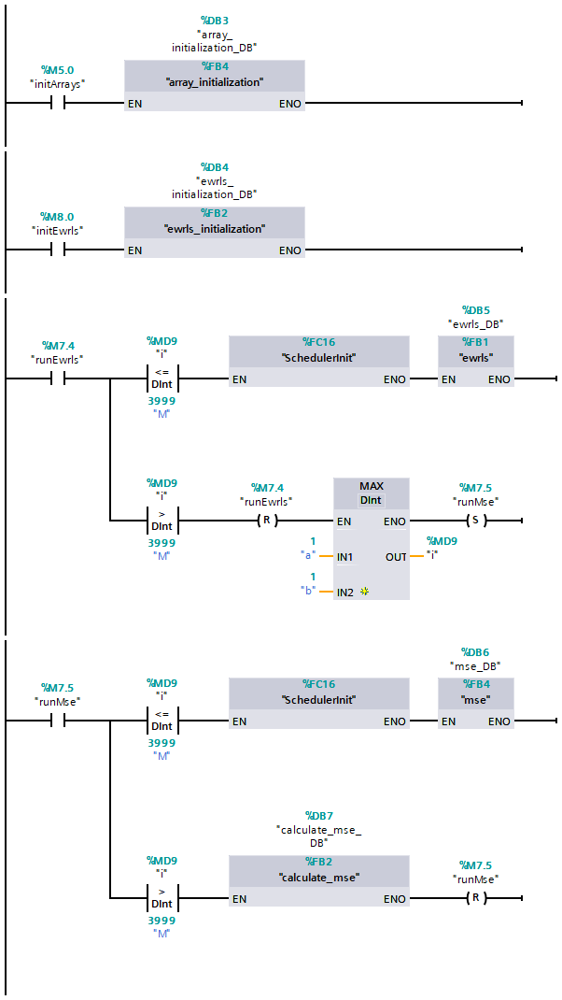

# The equally weighted least squares (EWRLS) algorithm
## Brief description
For the purpose of this work, the equally weighted least squares algorithm was 
implemented on a programmable logic controller (PLC). The development was done 
in Siemens' TIA Portal. Most of the program is written in SCL (Structured 
Control Language), with LAD (Ladder Diagram) elements used to create the 
program's general network.

The algorithm was tested on INTECO's 
[modular servo](https://www.inteco.com.pl/products/modular-servo/), where the 
input (`U`) was the pulse width sent to the tachogenerator (expressed as a 
fraction between 0 and 1) and the output (`Y`) is the rotational speed based on 
incremental encoder readings converted to rad/s.

There are two versions of the algorithm:
- Online: a cyclic interrupt is called every dT ms (tested: dT=10ms and 
dT=20ms). In each interrupt, new measurements of `U` and `Y` are made and EWRLS 
is called, returning a new value of the estimated model parameters. In order to 
ensure uniform sampling, this version does not use scheduling, which comes at 
the price of it not being able to estimate larger models (ones with many 
parameters) while the value of dT is small.
- Offline: this version does not use interrupts. Instead, values of `U` and `Y` 
are preloaded in arrays. Calculations are performed according to the scheduler.

## How it works
An in-depth description of the algorithm's inner workings is available 
[here](docs/ewrls_doc.pdf).

## Implementation (online)
### Tags
|    | Name                 | Data type |
|:--:|:--------------------:|:---------:|
|  1 | `procentPWM`         | `Real`    |
|  2 | `AIE1`               | `Word`    |
|  3 | `AIE2`               | `Word`    |
|  4 | `AIE3`               | `Word`    |
|  5 | `AIE4`               | `Word`    |
|  6 | `ENCODER_poprzednio` | `DInt`    |
|  7 | `ENCODER_aktualne`   | `DInt`    |
|  8 | `ENCODER_roznica`    | `DInt`    |
|  9 | `PWMstart`           | `Bool`    |
| 10 | `TachoSCALED`        | `Real`    |
| 11 | `PWM_PLC`            | `Word`    |
| 12 | `PWM1E5`             | `Real`    |
| 13 | `obroty_OBRperSEK`   | `Real`    |
| 14 | `obroty_RADperSEK`   | `Real`    |
| 15 | `i`                  | `DInt`    |
| 16 | `rejestracjaPWM`     | `Bool`    |
| 17 | `initArrays`         | `Bool`    |
| 18 | `initEwrls`          | `Bool`    |
| 19 | `runEwrls`           | `Bool`    |
| 20 | `lambda`             | `Real`    |
| 21 | `start_i`            | `DInt`    |

### Constants
|   | Name | Data type | Value       | Comment                                        |
|:-:|:----:|:---------:|:-----------:|:----------------------------------------------:|
| 1 | `M`  | `Int`     | 2499 / 3999 | decremented number of data samples             |
| 2 | `a`  | `Int`     |    2 /    1 | number of poles (a_i coefficients)             |
| 3 | `b`  | `Int`     |    2 /    1 | number of zeroes (b_i coefficients)            |
| 4 | `k`  | `Int`     |    1 /    1 | dead time                                      |
| 5 | `n`  | `Int`     |    3 /    1 | decremented number of all coefficients (a+b-1) |

### Data Block `Db_1`
|   | Name    | Data type               |
|:-:|:-------:|:-----------------------:|
| 1 | `U`     | `Array[0.."M"] of Real` |
| 2 | `Y`     | `Array[0.."M"] of Real` |

### Data Block `Db_ewrls`
|   | Name    | Data type                       |
|:-:|:-------:|:-------------------------------:|
| 1 | `eps`   | `Real`                          |
| 2 | `Phi`   | `Array[0.."n"] of Real`         |
| 3 | `K`     | `Array[0.."n"] of Real`         |
| 4 | `P`     | `Array[0.."n", 0.."n"] of Real` |
| 5 | `Theta` | `Array[0.."M", 0.."n"] of Real` |

### Network

### Code
The code of particular blocks can be viewed [here](online/).

## Implementation (offline)
### Tags
|   | Name                 | Data type |
|:-:|:--------------------:|:---------:|
| 1 | `initArrays`         | `Bool`    |
| 2 | `i`                  | `DInt`    |
| 3 | `initEwrls`          | `Bool`    |
| 4 | `runEwrls`           | `Bool`    |
| 5 | `runMse`             | `Bool`    |
| 6 | `mean_squared_error` | `LReal`   |

### Constants
|   | Name | Data type | Value       | Comment                                        |
|:-:|:----:|:---------:|:-----------:|:----------------------------------------------:|
| 1 | `M`  | `Int`     | 2499 / 3999 | decremented number of data samples             |
| 2 | `a`  | `Int`     |    2 /    1 | number of poles (a_i coefficients)             |
| 3 | `b`  | `Int`     |    2 /    1 | number of zeroes (b_i coefficients)            |
| 4 | `k`  | `Int`     |    1 /    1 | dead time                                      |
| 5 | `n`  | `Int`     |    3 /    1 | decremented number of all coefficients (a+b-1) |

### Data Block `Db_1`
|   | Name    | Data type               |
|:-:|:-------:|:-----------------------:|
| 1 | `U`     | `Array[0.."M"] of Real` |
| 2 | `Y`     | `Array[0.."M"] of Real` |

### Data Block `Scheduler`
|   | Name            | Data type |
|:-:|:---------------:|:---------:|
| 1 | `tm_break`      | `Bool`    |
| 2 | `flag_global`   | `UDInt`   |
| 3 | `flag_iter`     | `UDInt`   |
| 4 | `time_start`    | `DTL`     |
| 5 | `time_bound`    | `UDInt`   |
| 6 | `time_check`    | `DTL`     |
| 7 | `time_duration` | `UDInt`   |

### Network

### Code
The code of particular blocks can be viewed [here](offline/).
