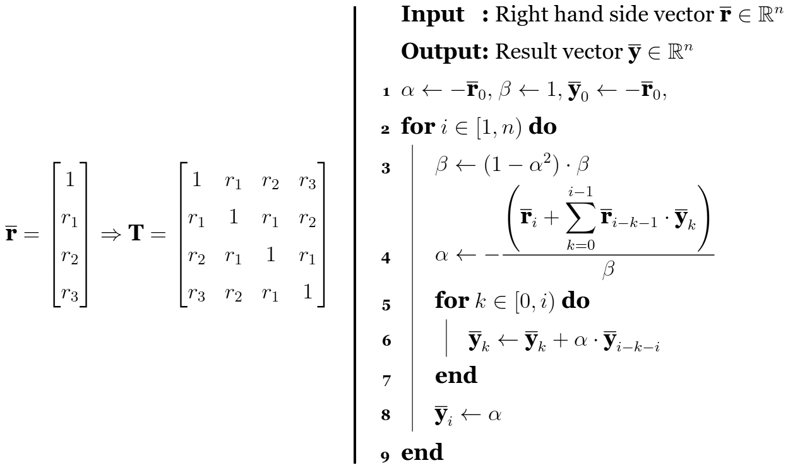
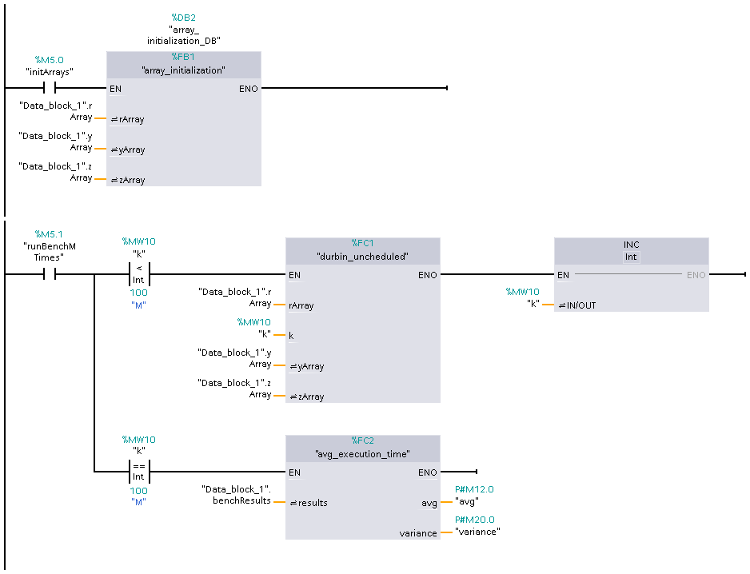

# The `durbin` benchmark
## Where it came from
The [durbin](../../src/durbin/durbin.st) benchmark is an SCL (Siemens' version 
of the ST language used in TIA Portal) implementation of another benchmark 
[of the same name](https://github.com/MatthiasJReisinger/PolyBenchC-4.2.1/tree/master/linear-algebra/solvers/durbin), 
written in C and available as a part of the 
[PolyBench 4.2.1 (beta)](https://sourceforge.net/projects/polybench/) benchmark 
suite. Copyright (c) 2011-2016 the Ohio State University. License available 
[here](https://github.com/MatthiasJReisinger/PolyBenchC-4.2.1/tree/master?tab=License-1-ov-file#readme).

## Brief description
According to the description provided with the original benchmark, it is a 
"Toeplitz system solver". More specifically, it solves a rather basic example 
of a Toeplitz system (finds the solution for an equation expressed as Ax=b, 
where A is a [Toeplitz matrix](https://en.wikipedia.org/wiki/Toeplitz_matrix#)), 
using 
[Levinson-Durbin recursion](https://en.wikipedia.org/wiki/Levinson_recursion#) 
and records the elapsed time. 

## How it works
`rArray` (of size `N`) is initialized with a decreasing sequence of numbers. 
After that point the local time is measured and saved in a variable. The 
symmetric Toeplitz matrix is created based on `rArray`. Pseudocode, taken 
from [^1], is presented below. 

After all the operations are performed, the local time is measured and saved 
into another variable. The difference between the two time measurements is the 
elapsed time. 

## Implementation (PLC)
### Tags
|   | Name             | Tag table         | Data type |
|:-:|:----------------:|:-----------------:|:---------:|
| 1 | `initArrays`     | Default tag table | `Bool`    |
| 2 | `runBenchMTimes` | Default tag table | `Bool`    |
| 3 | `k`              | Default tag table | `Int`     |
| 4 | `avg`            | Default tag table | `LReal`   |
| 5 | `variance`       | Default tag table | `LReal`   |

### Constants
|   | Name | Tag table         | Data type | Value | Comment                             |
|:-:|:----:|:-----------------:|:---------:|:-----:|:-----------------------------------:|
| 1 | `N`  | Default tag table | `Int`     | 120   | Decremented length of vector        |
| 2 | `M`  | Default tag table | `Int`     | 100   | How many times to run the benchmark |

### `Data_Block_1`
|   | Name           | Data type                       |
|:-:|:--------------:|:-------------------------------:|
| 1 | `rArray`       | `Array[0.."N"] of Real`/`LReal` |
| 2 | `yArray`       | `Array[0.."N"] of Real`/`LReal` |
| 3 | `zArray`       | `Array[0.."N"] of Real`/`LReal` |
| 4 | `benchResults` | `Array[0.."M"] of UDInt`        |
| 5 | `myTime1`      | `UDInt`                         |
| 6 | `myTime2`      | `UDInt`                         |

### Network

### Code
The code of particular blocks can be viewed [here](PLC/durbin.scl).

## Implementation (PC)
An implementation of this benchmark was also written in MATLAB. Its code can 
be viewed [here](PC/durbin.m).

## Results
The time it takes to perform the calculations depends on three things: 
- the number of elements (`N`) in vectors `rArray`, `yArray`, and a helper 
vector `zArray`, 
- the hardware used (tested: Siemens S7-1200, Siemens S7-1500), 
- the type of variable used (tested: 32-bit Real and 64-bit LReal). 
For PLC, each benchmark's result was an average of 100 runs. For PC, each 
benchmark's result was an average of 100000 runs.

### CPU 1215C DC/DC/DC
|     | Real        | Real              | LReal       | LReal             |
|:---:|:-----------:|:-----------------:|:-----------:|:-----------------:|
| `N` | avg. t [ms] | variance [(ms)^2] | avg. t [ms] | variance [(ms)^2] |
|  10 |    1.2040   |      0.1193       |    1.3906   |      0.1169       |
|  40 |   10.9707   |      2.4297       |   12.5558   |      3.3575       |
|  80 |   39.0328   |     34.4425       |   44.5245   |     14.9684       |
| 120 |   84.1629   |     36.5670       |   94.8628   |     54.1498       |

### CPU 1512C-1 PN
|     | Real        | Real              | LReal       | LReal             |
|:---:|:-----------:|:-----------------:|:-----------:|:-----------------:|
| `N` | avg. t [ms] | variance [(ms)^2] | avg. t [ms] | variance [(ms)^2] |
|  10 |    0.5438   |      0.0548       |    0.5809   |      0.0876       |
|  40 |    5.4910   |      1.5238       |    5.7486   |      1.4226       |
|  80 |   20.3056   |      6.0837       |   21.4318   |      6.7651       |
| 120 |   44.0912   |      6.8571       |   46.7149   |      6.9890       |
| 160 |   77.4141   |     10.5041       |   81.3465   |     80.0278       |

### CPU 1511TF-1 PN
|     | Real        | Real              | LReal       | LReal             |
|:---:|:-----------:|:-----------------:|:-----------:|:-----------------:|
| `N` | avg. t [ms] | variance [(ms)^2] | avg. t [ms] | variance [(ms)^2] |
|  10 |    0.0514   |      0.0000       |    0.0509   |      0.0000       |
|  40 |    0.6133   |      0.0084       |    0.6176   |      0.0102       |
|  80 |    2.2768   |      0.0428       |    2.2819   |      0.0468       |
| 120 |    5.0295   |      0.1495       |    5.0214   |      0.1401       |
| 160 |    8.8093   |      0.1973       |    8.8315   |      0.2364       |
| 400 |   53.8684   |      0.8274       |   53.8958   |      0.9253       |
| 600 |  120.5213   |      0.6550       |  120.6739   |      0.5814       |

### CPU 1214C AC/DC/relay
|     | Real        | Real              | LReal       | LReal             |
|:---:|:-----------:|:-----------------:|:-----------:|:-----------------:|
| `N` | avg. t [ms] | variance [(ms)^2] | avg. t [ms] | variance [(ms)^2] |
|  10 |    6.4352   |      0.5939       |    6.9667   |      0.8356       |
|  40 |   83.3204   |     12.2357       |   87.7869   |     15.9109       |
|  80 |  310.4136   |   1011.2950       |  352.0724   |  73751.6682       |
| 120 |  687.9542   |   4861.8481       |  740.6543   |  73563.2017       |
| 160 | 1286.2724   | 148237.3067       | 1307.3386   | 145881.7770       |

### Intel Core i3-8100 CPU 3.60GHz
|     | single      | single            | double      | double            |
|:---:|:-----------:|:-----------------:|:-----------:|:-----------------:|
| `N` | avg. t [ms] | variance [(ms)^2] | avg. t [ms] | variance [(ms)^2] |
| 120 | 6.675e-02   | 1.3821e-04        | 6.5353e-02  | 8.2134e-05        |

### 12th Gen Inter Core i5-12600K
|     | single      | single            | double      | double            |
|:---:|:-----------:|:-----------------:|:-----------:|:-----------------:|
| `N` | avg. t [ms] | variance [(ms)^2] | avg. t [ms] | variance [(ms)^2] |
| 120 | 3.50244e-02 | 1.4031e-04        | 3.5456e-02  | 9.4246e-05        |

### 13th Gen Intel Core i9-13900K
|     | single      | single            | double      | double            |
|:---:|:-----------:|:-----------------:|:-----------:|:-----------------:|
| `N` | avg. t [ms] | variance [(ms)^2] | avg. t [ms] | variance [(ms)^2] |
| 120 | 1.9137e-02  | 1.0904e-05        | 1.9578e-02  | 5.938e-06         |

## Problems encountered
The `N`s used in this particular implementation are low compared to the ones 
used in the original benchmark (40, 120, 400, 2000, 4000), since the code 
would not execute on much larger numbers. The source of this problem is the 
limited length of PLC's cycle, although that could be changed by modifying 
the default length of the cycle.

## Sources
[^1]: ASKAR VERGARA, Omar; TÖRNBLOM BARTHOLF, Karl. Benchmarking linear-algebra 
algorithms on CPU-and FPGA-based platforms. 2023, p. 16-17. URL: 
[https://www.diva-portal.org/smash/get/diva2:1778346/FULLTEXT01.pdf](https://www.diva-portal.org/smash/get/diva2:1778346/FULLTEXT01.pdf). 
