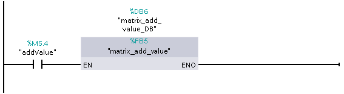
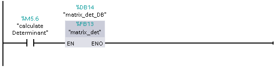
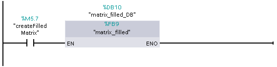
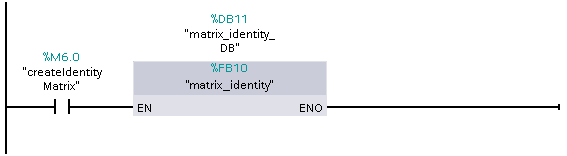
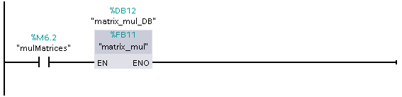
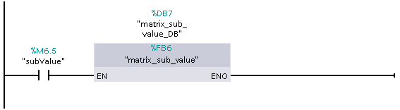
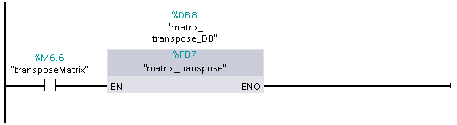

It its current form, the matrix library does not have scheduling implemented. 
For that reason, they may not work when applied to larger arrays.

It's recommended to keep the same convention of setting lower bounds of arrays 
(i.e. if array elements are numbered from 0, 1, or some other number), 
otherwise you may need to spend some time debugging.

#### Table of Contents
- [`MatrixAdd`](#matrixadd) (adds two matrices)
- [`MatrixAddval`](#matrixaddval) (adds a value to a matrix)
- [`MatrixConcat`](#matrixconcat) (concatenates two matrices)
- [`MatrixDet`](#matrixdet) (calculates a square matrix's determinant)
- [`MatrixFilled`](#matrixfilled) (fills a matrix with a value)
- [`MatrixIdentity`](#matrixidentity) (sets a matrix to be an identity matrix)
- [`MatrixInvert`](#matrixinvert) (inverts a square matrix; **the input matrix
gets overwritten by an identity matrix**)
- [`MatrixMul`](#matrixmul) (mutliplies two matrices)
- [`MatrixMulVal`](#matrixmulval) (multiplies a matrix by a value)
- [`MatrixSub`](#matrixsub) (subtracts one matrix from another)
- [`MatrixSubVal`](#matrixsubval) (subtracts a value from a matrix)
- [`MatrixTranspose`](#matrixtranspose) (transposes a matrix)
- `GaussRandom` (an undocumented Function Block, returns a random value)

## Main Functions

### `MatrixAdd`

#### Description
Adds two two-dimensional arrays (`A` and `B`) of type `Real` and stores the 
result in a two-dimensional array `C` of type `Real` (`A` and `B` don't 
change). `A` and `B` need to have the same lower and upper bounds in both 
dimensions. `C`'s bounds need to contain the bounds of `A` and `B`. For example:
- if `C` is defined as `Array[0..7, 1..9]`, while `A` and `B` are both also
defined as `Array[0..7, 1..9]`, the addition **will** work properly, since `A`, 
`B`, and `C` have the same bounds
- if `C` is defined as `Array[0..7, 1..9]`, while `A` and `B` are both defined 
as `Array[0..7, 2..8]`, the addition **will** work properly, although the 1st 
and 9th columns of the `C` array will not be altered, and the result of the 
addition operation will be stored in the columns between them
- if `C` is defined as `Array[0..7, 1..9]`, while `A` and `B` are both defined 
as `Array[0..8, 1..9]`, the addition **will not** work properly, since `A` and 
`B` have one more row than `C`.

#### Input arguments
- `A`: a two-dimensional array of type `Real`. Needs to have the same lower and 
upper bounds as `B` in both dimensions.
- `B`: a two-dimensional array of type `Real`. Needs to have the same lower and 
upper bounds as `A` in both dimensions.

#### Output arguments
- `C`: a two-dimensional array of type `Real`. `C`'s bounds need to contain the 
bounds of `A` and `B`.

#### Example use inside Function Block
If `addMatrices` is `True`, the Function Block adds `Data_block_1.mat_A` and 
`Data_block_1.mat_B` and stores the result in `Data_block_1.mat_C`.


- `addMatrices`: `Bool`
- `N`: `Int` (constant)
- `M`: `Int` (constant)
- `Data_block_1.mat_A`: `Array[0.."N", 0.."M"] of Real`
- `Data_block_1.mat_B`: `Array[0.."N", 0.."M"] of Real`
- `Data_block_1.mat_C`: `Array[0.."N", 0.."M"] of Real`

```
FUNCTION_BLOCK "matrices_add"
{ S7_Optimized_Access := 'TRUE' }
VERSION : 0.1

BEGIN
	"MatrixAdd"(A := "Data_block_1".mat_A,
	            B := "Data_block_1".mat_B,
	            C => "Data_block_1".mat_C);
	"addMatrices" := FALSE;
	
END_FUNCTION_BLOCK
```

### `MatrixAddVal`

#### Description
Adds a `Real` number `val` to each element of a two-dimensional array `A` of 
type `Real` and stores the result in a two-dimensional array `C` of type 
`Real` (`A` doesn't change). `C`'s bounds need to contain the bounds of `A`. 
For example: 
- if `C` is defined as `Array[0..7, 1..9]`, while `A` is defined as 
`Array[0..7, 1..9]`, the addition **will** work properly, since `A` and `C` 
have the same bounds
- if `C` is defined as `Array[0..7, 1..9]`, while `A` is defined as 
`Array[0..7, 2..8]`, the addition **will** work properly, although the 1st 
and 9th columns of the `C` array will not be altered, and the result of the 
addition operation will be stored in the columns between them
- if `C` is defined as `Array[0..7, 1..9]`, while `A` is defined as 
`Array[0..8, 1..9]`, the addition **will not** work properly, since `A` has one 
more row than `C`.

#### Input arguments
- `A`: a two-dimensional array of type `Real`
- `val`: the number of type `Real` to be added to `A`

#### Output arguments
- `C`: a two-dimensional array of type `Real`. `C`'s bounds need to contain the 
bounds of `A`.

#### Example use inside Function Block
If `addValue` is `True`, the Function Block adds `value` to each element of 
`Data_block_1.mat_A` and stores the result in `Data_block_1.mat_C`.



- `addValue`: `Bool`
- `N`: `Int` (constant)
- `M`: `Int` (constant)
- `Data_block_1.mat_A`: `Array[0.."N", 0.."M"] of Real`
- `value`: `Real`
- `Data_block_1.mat_C`: `Array[0.."N", 0.."M"] of Real`

```
FUNCTION_BLOCK "matrix_add_value"
{ S7_Optimized_Access := 'TRUE' }
VERSION : 0.1

BEGIN
	"MatrixAddVal"(A := "Data_block_1".mat_A,
	               val := "value",
	               C => "Data_block_1".mat_C);
	"addValue" := FALSE;
	
END_FUNCTION_BLOCK
```

### `MatrixConcat`

#### Description
Concatenates a two-dimensional array `A` of type `Real` with a two-dimensional 
array `B` of type `Real` (in that order) along the dimension `dim` (1 or 2) and 
stores the result in `C` (`A` and `B` don't change). The bounds of the 
dimension of `A` and `B` not defined by `dim` need to be the same. For example, 
if `dim`=2, the bounds of the 1st dimension of `A` and `B` need to match. 

The lower bound of the dimension of `C` defined by `dim` needs to be lower than 
or equal to the lower bound of the dimension of `A` defined by `dim`. The upper 
bound of the dimension of `C` defined by `dim` needs to be greater than or 
equal to the upper bound of the dimension of `A` defined by `dim`. 

The lower bound of the dimension of `C` not defined by `dim` needs to be lower 
than or equal to the lower bound of the dimension of `A` not defined by `dim`. 
The upper bound of the dimension of `C` not defined by `dim` needs to be higher 
than or equal to `M`+`P`+1, where `M` is the upper bound of the dimension of 
`A` not defined by `dim` and `P` is the upper bound of the dimension of `B` not 
defined by `dim`.

For example: 
- if `C` is defined as `Array[0..7, 4..9]`, while `A` is defined as 
`Array[0..2, 4..9]`, `B` is defined as `Array[1..5, 4..9]`, and `dim` is 1, 
the concatenation **will** work properly (`A` has 3 rows, `B` has 5, `C` has 
8, which is greater than or equal to 8)
- if everything is the same as in the first example, but `dim` is 2, the 
concatenation **will not** work properly, since the bounds of `A` and `B`'s 1st 
dimension don't match
- if everything is the same as in the first example, but `A` is defined as 
`Array[1..3, 4..9]`, the concatenation **will not** work properly, because 
although the number of rows and columns are proper, `C`'s rows will not be 
numbered from 0, but rather from 1, so `C` will be one row short

#### Input arguments
- `A`: a two-dimensional array of `Real`. Its bounds are subject to limitations 
described above.
- `B`: a two-dimensional array of `Real`. Its bounds are subject to limitations 
described above.
- `dim`: the dimension along which the arrays are to be concatendated (`UDInt`)

#### Output arguments
- `C`: a two-dimensional array of type `Real`. Its bounds are subject to 
limitations described above.

#### Example use inside Function Block
If `concatMatrices` is `True`, the Function Block concatenates 
`Data_block_1.mat_A` and `Data_block_1.mat_B` along the 2nd dimension and 
stores the result in `Data_block_1.mat_C`.


- `concatMatrices`: `Bool`
- `N`: `Int` (constant)
- `M`: `Int` (constant)
- `P`: `Int` (constant)
- `R`: `Int` (constant, equal to `M`+`P`+1)
- `Data_block_1.mat_A`: `Array[0.."N", 0.."M"] of Real`
- `Data_block_1.mat_B`: `Array[0.."N", 0.."P"] of Real`
- `Data_block_1.mat_C`: `Array[0.."N", 0.."R"] of Real`

```
FUNCTION_BLOCK "matrix_concat"
{ S7_Optimized_Access := 'TRUE' }
VERSION : 0.1

BEGIN
	"MatrixConcat"(A := "Data_block_1".mat_A,
	               B := "Data_block_1".mat_B,
	               dim := 2,
	               C => "Data_block_1".mat_C);
	"concatMatrices" := FALSE;
	
END_FUNCTION_BLOCK
```

### `MatrixDet`

#### Description
Calculates the determinant of a two-dimensional square array `A` and stores it 
in `det`.

#### Input arguments
- `A`: a two-dimensional square array of type `Real`

#### Output arguments
- `det`: the determinant of `A` (`Real`)

#### Example use inside Function Block
If `calculateDeterminant` is `True`, the Function Block calculates the 
determinant of `Data_block_1.mat_A` and stores the result in 
`determinant`.



- `calculateDeterminant`: `Bool`
- `N`: `Int` (constant)
- `Data_block_1.mat_A`: `Array[0.."N", 0.."N"] of Real`
- `determinant`: `Real`

```
FUNCTION_BLOCK "matrix_det"
{ S7_Optimized_Access := 'TRUE' }
VERSION : 0.1

BEGIN
	"MatrixDet"(A := "Data_block_1".mat_A,
	            det => "determinant");
	"calculateDeterminant" := FALSE;
	
END_FUNCTION_BLOCK
```

### `MatrixFilled`

#### Description
Fills a two-dimensional array `C` of type `Real` with `value`.

#### Input arguments
- `lb_1`: the lower bound of the newly created array's 1st dimension (`Int`)
- `lb_2`: the lower bound of the newly created array's 2nd dimension (`Int`)
- `ub_1`: the upper bound of the newly created array's 1st dimension (`Int`)
- `ub_2`: the upper bound of the newly created array's 2nd dimension (`Int`)
- `val`: the value to fill the newly created array with (`Real`)

#### Output arguments
- `C`: a two-dimensional array of type `Real`, which gets filled with `value`

#### Example use inside Function Block
If `createFilledMatrix` is `True`, the Function Block creates an array filled 
with `value` and stores the result in `Data_block_1.mat_C`.



- `createFilledMatrix`: `Bool`
- `N`: `Int` (constant)
- `M`: `Int` (constant)
- `value`: `Real`
- `Data_block_1.mat_C`: `Array[0.."N", 0.."M"] of Real`

```
FUNCTION_BLOCK "matrix_filled"
{ S7_Optimized_Access := 'TRUE' }
VERSION : 0.1

BEGIN
	"MatrixFilled"(lb_1 := 0,
	               lb_2 := 0,
	               ub_1 := "N",
	               ub_2 := "N",
	               val := "value",
	               C => "Data_block_1".mat_C);
	"createFilledMatrix" := FALSE;
	
END_FUNCTION_BLOCK
```

### `MatrixIdentity`

#### Description
Creates a two-dimensional square identity array `C` of type `Real`.

#### Input arguments
- `lb`: the lower bound of the newly created array's 1st and 2nd dimension 
(`Int`)
- `ub`: the upper bound of the newly created array's 1st and 2nd dimension 
(`Int`)

#### Output arguments
- `C`: a two-dimensional square identity array of type `Real`

#### Example use inside Function Block
If `createIdentityMatrix` is `True`, the Function Block creates a square 
identity array and stores the result in `Data_block_1.mat_C`.



- `createIdentityMatrix`: `Bool`
- `N`: `Int` (constant)
- `Data_block_1.mat_C`: `Array[0.."N", 0.."N"] of Real`

```
FUNCTION_BLOCK "matrix_identity"
{ S7_Optimized_Access := 'TRUE' }
VERSION : 0.1

BEGIN
	"MatrixIdentity"(lb := 0,
	                 ub := "N",
	                 C => "Data_block_1".mat_C);
	"createIdentityMatrix" := FALSE;
	
END_FUNCTION_BLOCK
```

### `MatrixInvert`

#### Description
Inverts square array `A` and stores the result in `C`. **WARNING: `A` gets 
overwritten by an identity matrix in the process!**

#### Input arguments
- `A`: a two-dimensional square array of type `Real`

#### Output arguments
- `C`: a two-dimensional square array of type `Real`, which is the inverse of 
`A`

#### Example use inside Function Block
If `invertMatrix` is `True`, the Function Block inverts `Data_block_1.mat_A` 
and stores the result in `Data_block_1.mat_C`. `Data_block_1.mat_A` gets 
overwritten by an identity matrix.


- `invertMatrix`: `Bool`
- `N`: `Int` (constant)
- `Data_block_1.mat_A`: `Array[0.."N", 0.."N"] of Real`
- `Data_block_1.mat_C`: `Array[0.."N", 0.."N"] of Real`

```
FUNCTION_BLOCK "matrix_invert"
{ S7_Optimized_Access := 'TRUE' }
VERSION : 0.1

BEGIN
	"MatrixInvert"(A := "Data_block_1".mat_A,
	               C => "Data_block_1".mat_C);
	"invertMatrix" := FALSE;
	
END_FUNCTION_BLOCK
```

### `MatrixMul`

#### Description
Multiplies two two-dimensional arrays `A` and `B` of type `Real` (`A`*`B`) and 
stores the result in a two-dimensional array `C` of type `Real` (`A` and `B` 
don't change). The bounds of `A`'s 2nd dimension (columns) need to be the same 
as the bounds of `B`'s 1st dimension (rows). The bounds of `C`'s 1st dimension 
(rows) need to contain the bounds of `A`'s 1st dimension and the bounds of 
`C`'s 2nd dimension (columns) need to contain the bounds of `B`'s 2nd 
dimension. For example: 
- if `C` is defined as `Array[0..7, 1..9]`, while `A` is defined as 
`Array[0..7, 3..10]` and `B` is defined as `Array[3..10, 1..9]`, the 
multiplication **will** work properly
- if `C` is defined as `Array[0..7, 1..9]`, while `A` is defined as 
`Array[0..7, 3..10]` and `B` is defined as `Array[3..10, 2..8]`, the 
multiplication **will** work properly, although the 1st and 9th columns of the 
`C` array will not be altered, and the result of the multiplication operation 
will be stored in the columns between them
- if `C` is defined as `Array[0..7, 1..9]`, while `A` is defined as 
`Array[0..8, 3..10]` and `B` is defined as `Array[3..10, 1..9]`, the 
multiplication **will not** work properly, since `A` has one more row than `C`.

#### Input arguments
- `A`: a two-dimensional array of type `Real`. The lower and upper bounds of 
its 2nd dimension need to be the same as the lower and upper bounds of `B`'s 
1st dimension.
- `B`: a two-dimensional array of type `Real`. The lower and upper bounds of 
its 1st dimension need to be the same as the lower and upper bounds of `A`'s 
2nd dimension.

#### Output arguments
- `C`: a two-dimensional array of type `Real`. The bounds of `C`'s 1st 
dimension need to contain the bounds of `A`'s 1st dimension and the bounds of 
`C`'s 2nd dimension need to contain the bounds of `B`'s 2nd dimension.

#### Example use inside Function Block
If `mulMatrices` is `True`, the Function Block multiplies 
`Data_block_1.mat_A` by `Data_block_1.mat_B` and stores the result in 
`Data_block_1.mat_C`.



- `mulMatrices`: `Bool`
- `N`: `Int` (constant)
- `M`: `Int` (constant)
- `P`: `Int` (constant)
- `Data_block_1.mat_A`: `Array[0.."N", 0.."P"] of Real`
- `Data_block_1.mat_B`: `Array[0.."P", 0.."M"] of Real`
- `Data_block_1.mat_C`: `Array[0.."N", 0.."M"] of Real`

```
FUNCTION_BLOCK "matrix_mul"
{ S7_Optimized_Access := 'TRUE' }
VERSION : 0.1

BEGIN
	"MatrixMul"(A := "Data_block_1".mat_A,
	            B := "Data_block_1".mat_B,
	            C => "Data_block_1".mat_C);
	"mulMatrices" := FALSE;
	
END_FUNCTION_BLOCK
```

### `MatrixMulVal`

#### Description
Multiplies from each element of a two-dimensional array `A` of type `Real` by a 
`Real` number `val` and stores the result in a two-dimensional array `C` of 
type `Real` (`A` doesn't change). `C`'s bounds need to contain the bounds of 
`A`. For example: 
- if `C` is defined as `Array[0..7, 1..9]`, while `A` is defined as 
`Array[0..7, 1..9]`, the multiplication **will** work properly, since `A` and 
`C` have the same bounds
- if `C` is defined as `Array[0..7, 1..9]`, while `A` is defined as 
`Array[0..7, 2..8]`, the multiplication **will** work properly, although 
the 1st and 9th columns of the `C` array will not be altered, and the result of 
the multiplication operation will be stored in the columns between them
- if `C` is defined as `Array[0..7, 1..9]`, while `A` is defined as 
`Array[0..8, 1..9]`, the multiplication **will not** work properly, since `A` 
has one more row than `C`.

#### Input arguments
- `A`: a two-dimensional array of type `Real`
- `val`: `Real`

#### Output arguments
- `C`: a two-dimensional array of type `Real`. `C`'s bounds need to contain the 
bounds of `A`.

#### Example use inside Function Block
If `mulValue` is `True`, the Function Block multiplies each element of 
`Data_block_1.mat_A` by `value` and stores the result in 
`Data_block_1.mat_C`.


- `mulValue`: `Bool`
- `N`: `Int` (constant)
- `M`: `Int` (constant)
- `Data_block_1.mat_A`: `Array[0.."N", 0.."M"] of Real`
- `value`: `Real`
- `Data_block_1.mat_C`: `Array[0.."N", 0.."M"] of Real`

```
FUNCTION_BLOCK "matrix_mul_val"
{ S7_Optimized_Access := 'TRUE' }
VERSION : 0.1

BEGIN
	"MatrixMulVal"(A := "Data_block_1".mat_A,
	               val := "value",
	               C => "Data_block_1".mat_C);
	"mulValue" := FALSE;
	
END_FUNCTION_BLOCK
```

### `MatrixSub`

#### Description
Subtracts a two-dimensional array `B` of type `Real` from a two-dimensional 
array `A` of type `Real` and stores the result in a two-dimensional array `C` 
of type `Real` (`A` and `B` don't change). `A` and `B` need to have the same 
lower and upper bounds in both dimensions. `C`'s bounds need to contain the 
bounds of `A` and `B`. For example: 
- if `C` is defined as `Array[0..7, 1..9]`, while `A` and `B` are both also
defined as `Array[0..7, 1..9]`, the subtraction **will** work properly, since 
`A`, `B`, and `C` have the same bounds
- if `C` is defined as `Array[0..7, 1..9]`, while `A` and `B` are both defined 
as `Array[0..7, 2..8]`, the subtraction **will** work properly, although the 
1st and 9th columns of the `C` array will not be altered, and the result of the 
subtraction operation will be stored in the columns between them
- if `C` is defined as `Array[0..7, 1..9]`, while `A` and `B` are both defined 
as `Array[0..8, 1..9]`, the subtraction **will not** work properly, since `A` 
and `B` have one more row than `C`.

#### Input arguments
- `A`: a two-dimensional array of type `Real`. Needs to have the same lower and 
upper bounds as `B` in both dimensions.
- `B`: a two-dimensional array of type `Real`. Needs to have the same lower and 
upper bounds as `A` in both dimensions.

#### Output arguments
- `C`: a two-dimensional array of type `Real`. `C`'s bounds need to contain the 
bounds of `A` and `B`.

#### Example use inside Function Block
If `subMatrices` is `True`, the Function Block subtracts `Data_block_1.mat_B` 
from `Data_block_1.mat_A` and stores the result in `Data_block_1.mat_C`.


- `subMatrices`: `Bool`
- `N`: `Int` (constant)
- `M`: `Int` (constant)
- `Data_block_1.mat_A`: `Array[0.."N", 0.."M"] of Real`
- `Data_block_1.mat_B`: `Array[0.."N", 0.."M"] of Real`
- `Data_block_1.mat_C`: `Array[0.."N", 0.."M"] of Real`

```
FUNCTION_BLOCK "matrices_sub"
{ S7_Optimized_Access := 'TRUE' }
VERSION : 0.1

BEGIN
	"MatrixSub"(A := "Data_block_1".mat_A,
	            B := "Data_block_1".mat_B,
	            C => "Data_block_1".mat_C);
	"subMatrices" := FALSE;
	
END_FUNCTION_BLOCK
```

### `MatrixSubVal`

#### Description
Subtracts a `Real` number `val` from each element of a two-dimensional array 
`A` of type `Real` and stores the result in a two-dimensional array `C` of type 
`Real` (`A` doesn't change). `C`'s bounds need to contain the bounds of `A`. 
For example: 
- if `C` is defined as `Array[0..7, 1..9]`, while `A` is defined as 
`Array[0..7, 1..9]`, the subtraction **will** work properly, since `A` and `C` 
have the same bounds
- if `C` is defined as `Array[0..7, 1..9]`, while `A` is defined as 
`Array[0..7, 2..8]`, the subtraction **will** work properly, although 
the 1st and 9th columns of the `C` array will not be altered, and the result of 
the subtraction operation will be stored in the columns between them
- if `C` is defined as `Array[0..7, 1..9]`, while `A` is defined as 
`Array[0..8, 1..9]`, the subtraction **will not** work properly, since `A` has 
one more row than `C`.

#### Input arguments
- `A`: a two-dimensional array of type `Real`
- `val`: `Real`

#### Output arguments
- `C`: a two-dimensional array of type `Real`. `C`'s bounds need to contain the 
bounds of `A`.

#### Example use inside Function Block
If `subValue` is `True`, the Function Block subtracts `value` from each element 
of `Data_block_1.mat_A` and stores the result in `Data_block_1.mat_C`.



- `subValue`: `Bool`
- `N`: `Int` (constant)
- `M`: `Int` (constant)
- `Data_block_1.mat_A`: `Array[0.."N", 0.."M"] of Real`
- `value`: `Real`
- `Data_block_1.mat_C`: `Array[0.."N", 0.."M"] of Real`

```
FUNCTION_BLOCK "matrix_sub_value"
{ S7_Optimized_Access := 'TRUE' }
VERSION : 0.1

BEGIN
	"MatrixSubVal"(A := "Data_block_1".mat_A,
	               val := "value",
	               C => "Data_block_1".mat_C);
	"subValue" := FALSE;
	
END_FUNCTION_BLOCK
```

### `MatrixTranspose`

#### Description
Transposes a two-dimensional array `A` of type `Real` and stores the result in 
a two-dimensional array `C` of type `Real` (`A` doesn't change). The bounds of 
`C`'s 1st dimension (rows) need to contain the bounds of `A`'s 2nd dimension 
(columns). The bounds of `C`'s 2nd dimension (columns) need to contain the 
bounds of `A`'s 1st dimension (rows). For example: 
- if `C` is defined as `Array[0..7, 1..9]`, while `A` is defined as 
`Array[1..9, 0..7]`, the transposition **will** work properly, since the bounds 
of `A` and `C` are "flipped"
- if `C` is defined as `Array[0..7, 1..9]`, while `A` is defined as 
`Array[2..8, 0..7]`, the transposition **will** work properly, although 
the 1st and 9th columns of the `C` array will not be altered, and the result of 
the transposition operation will be stored in the columns between them
- if `C` is defined as `Array[0..7, 1..9]`, while `A` is defined as 
`Array[1..9, 0..8]`, the transposition **will not** work properly, since the 
number of columns in `A` is larger than the number of rows in `C`.

#### Input arguments
- `A`: a two-dimensional array of type `Real`

#### Output arguments
- `C`: a two-dimensional array of type `Real`. The bounds of `C`'s 1st 
dimension (rows) need to contain the bounds of `A`'s 2nd dimension (columns). 
The bounds of `C`'s 2nd dimension (columns) need to contain the bounds of `A`'s 
1st dimension (rows).

#### Example use inside Function Block
If `transposeMatrix` is `True`, the Function Block transposes 
`Data_block_1.mat_A` and stores the result in `Data_block_1.mat_C`.



- `transposeMatrix`: `Bool`
- `N`: `Int` (constant)
- `M`: `Int` (constant)
- `Data_block_1.mat_A`: `Array[0.."N", 0.."M"] of Real`
- `value`: `Real`
- `Data_block_1.mat_C`: `Array[0.."M", 0.."N"] of Real`

```
FUNCTION_BLOCK "matrix_transpose"
{ S7_Optimized_Access := 'TRUE' }
VERSION : 0.1

BEGIN
	"MatrixTranspose"(A := "Data_block_1".mat_A,
	                  C => "Data_block_1".mat_C);
	"transposeMatrix" := FALSE;
	
END_FUNCTION_BLOCK
```
